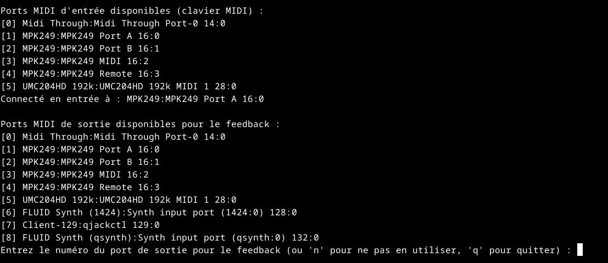
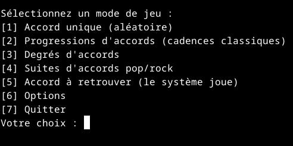
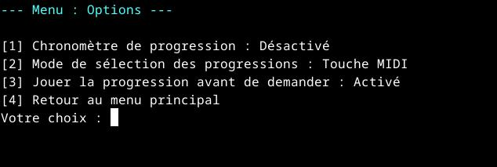

# Entraîneur d'accords MIDI

Cet outil est un programme d'entraînement en ligne de commande conçu pour aider les musiciens à améliorer leurs compétences en théorie musicale, en particulier la reconnaissance et l'exécution des accords et des progressions d'accords. En se connectant à un clavier **MIDI**, il offre une expérience interactive pour pratiquer directement depuis votre terminal.

### Installation et utilisation sous Linux

Pour installer et utiliser ce programme sous Linux, suivez ces étapes simples.

#### 1. Prérequis

Assurez-vous que Python 3 est installé sur votre système.  
Si Python n'est pas installé, vous pouvez le faire via votre gestionnaire de paquets (par exemple, `sudo apt install python3` sur Debian/Ubuntu ou `sudo dnf install python3` sur Fedora).

#### 2. Cloner le dépôt et installer les dépendances

Ouvrez un terminal, clonez le dépôt et naviguez vers le dossier du projet :  
[https://github.com/gylles38/chords-training.git ](https://github.com/gylles38/chords-training.git)  
cd chords-training  

Installez ensuite les bibliothèques Python nécessaires (`mido` et `python-rtmidi`) :

pip install mido python-rtmidi

#### 3. Configuration MIDI

Assurez-vous que votre clavier MIDI est connecté. Vous devrez peut-être créer un port MIDI virtuel pour la sortie si vous souhaitez utiliser le retour MIDI du programme. Vous pouvez utiliser `aconnect` pour cela.

Pour lister les ports disponibles :

aconnect -i -o

Puis connectez les ports si nécessaire. Par exemple : `aconnect 20:0 14:0`

#### 4. Lancement du programme

Une fois les dépendances installées et le port MIDI configuré, vous pouvez lancer le programme en exécutant le script Python :

python chords-training.py

Le programme vous demandera de choisir les ports d'entrée et de sortie MIDI que vous souhaitez utiliser.

### Aperçu du Programme

  

 
 

### Fonctionnalités principales

* **Mode Accords Simples** : Entraînez-vous à jouer des accords individuels affichés à l'écran. Le programme vous indique si vous avez réussi ou non.

* **Mode Progressions d'Accords** : Exercez-vous avec des séquences d'accords courantes. Une fois la progression jouée, le programme vous donne une rétroaction instantanée.

* **Mode Degrés** : Apprenez à reconnaître et à jouer des accords basés sur leurs degrés dans une tonalité (par exemple, I, IV, V).

* **Mode Pop/Rock** : Pratiquez des progressions spécifiques et populaires, idéales pour les guitaristes ou les pianistes.

* **Mode Inverse** : Jouez un accord sur votre clavier MIDI, et le programme l'identifiera pour vous, parfait pour l'apprentissage par l'oreille.

### Statistiques et Options

Le programme ne conserve pas de statistiques de performance pour le moment, mais il offre un **menu d'options** pour personnaliser l'expérience d'entraînement. Vous pouvez notamment :

* **Activer un chronomètre** pour les modes de progression afin de vous challenger à jouer plus rapidement.

* **Choisir le mode de sélection des progressions**, soit de manière aléatoire, soit en utilisant une touche MIDI pour choisir la progression que vous souhaitez travailler.

* **Activer/désactiver la lecture de la progression** avant de commencer l'exercice, ce qui est utile pour l'apprentissage auditif.  

Le programme affiche également un bilan de vos performances (nombre d'accords corrects/incorrects, temps) lorsque vous quittez un mode d'entraînement, ce qui vous permet de suivre vos progrès.
