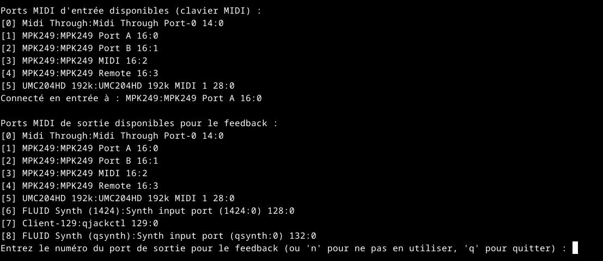
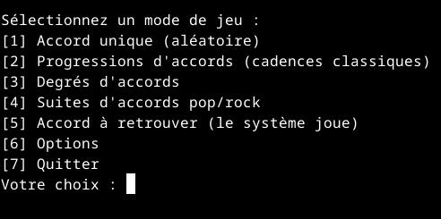
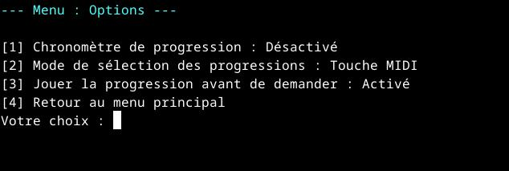

# Entraîneur d'accords MIDI

Cet outil est un programme d'entraînement en ligne de commande conçu pour aider les musiciens à améliorer leurs compétences en théorie musicale, en particulier la reconnaissance et l'exécution des accords et des progressions d'accords. En se connectant à un clavier **MIDI**, il offre une expérience interactive pour pratiquer directement depuis votre terminal.

### Installation et utilisation sous Linux

Pour installer et utiliser ce programme sous Linux, suivez ces étapes simples.

#### 1. Prérequis

Assurez-vous que Python 3 et pip sont installés sur votre système.
Si ce n'est pas le cas, vous pouvez les installer via votre gestionnaire de paquets (par exemple, `sudo apt install python3 python3-pip` sur Debian/Ubuntu).

#### 2. Cloner le dépôt et installer les dépendances

Ouvrez un terminal, clonez le dépôt et naviguez vers le dossier du projet :
```bash
git clone https://github.com/gylles38/chords-training.git
cd chords-training
```

Installez ensuite les bibliothèques Python nécessaires (`mido`, `python-rtmidi`, et `rich`) :
```bash
pip install -r requirements.txt
```
*(Note: Si un `requirements.txt` n'est pas disponible, installez manuellement avec `pip install mido python-rtmidi rich`)*

#### 3. Configuration MIDI

Assurez-vous que votre clavier MIDI est connecté. Vous devrez peut-être créer un port MIDI virtuel pour la sortie si vous souhaitez utiliser le retour MIDI du programme. Vous pouvez utiliser `aconnect` pour cela.

Pour lister les ports disponibles :
```bash
aconnect -i -o
```

Puis connectez les ports si nécessaire. Par exemple : `aconnect 20:0 14:0`

#### 4. Lancement du programme

Une fois les dépendances installées et le port MIDI configuré, vous pouvez lancer le programme en exécutant le script Python :
```bash
python3 main.py
```
Le programme vous demandera de choisir les ports d'entrée et de sortie MIDI que vous souhaitez utiliser.

### Aperçu du Programme

  

 
 


### Fonctionnalités principales

* **Parcours de Progression** : Une nouvelle fonctionnalité majeure ! Ce mode vous guide à travers un parcours d'apprentissage structuré, des notes simples aux transitions d'accords complexes. Votre progression est sauvegardée, vous permettant de reprendre là où vous vous êtes arrêté. Idéal pour les débutants ou ceux qui cherchent une méthode d'étude claire.

* **Modes Libres** : En plus du parcours, tous les exercices sont disponibles individuellement pour un entraînement ciblé :
    * **Reconnaissance de notes et d'accords** : Entraînez-vous à identifier des notes ou des accords simples.
    * **Écoute et Devine** : Développez votre oreille en reproduisant des notes ou des accords joués par le programme.
    * **Progressions d'accords** : Exercez-vous avec des séquences d'accords (générales, tonales, cadences, pop/rock).
    * **Trouve l'accord manquant** : Un exercice d'oreille avancé où vous devez identifier un accord manquant dans une progression.
    * **Reconnaissance Libre** : Jouez n'importe quel accord sur votre clavier et le programme l'identifiera pour vous.
    * **Explorateur d'accords** : Un dictionnaire sonore pour jouer et écouter n'importe quel accord.

### Statistiques et Options

Le programme sauvegarde votre progression dans le **Parcours de Progression** et conserve des records de performance pour les différents modes de jeu. Il offre également un **menu d'options** pour personnaliser l'expérience d'entraînement. Vous pouvez notamment :

* **Activer un chronomètre** pour les modes de progression afin de vous challenger à jouer plus rapidement.
* **Choisir le mode de sélection des progressions**, soit de manière aléatoire, soit en utilisant une touche MIDI pour choisir la progression que vous souhaitez travailler.
* **Activer/désactiver la lecture de la progression** avant de commencer l'exercice, ce qui est utile pour l'apprentissage auditif.  

Un bilan de vos performances (nombre d'accords corrects/incorrects, temps) s'affiche lorsque vous quittez un mode d'entraînement, vous permettant de suivre vos progrès.
